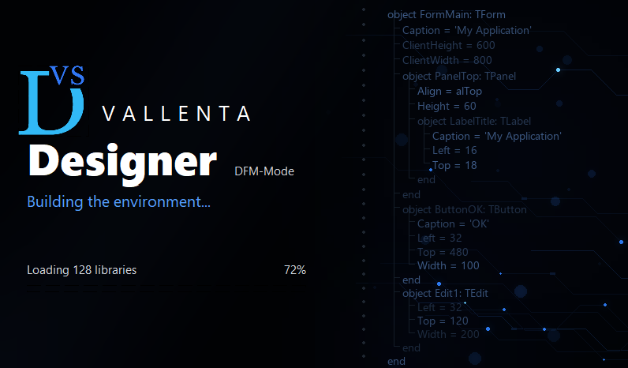

# Vallenta Designer



A visual form designer for `.dfm` files — the form editor of **Vallenta Studio**

Vallenta Designer opens a `.dfm` in a designer window with a component palette, an object
inspector and a messages pane. Components can be placed, selected, moved, resized and deleted,
their properties edited, and the file is written back in the exact text format the IDE
produces. 

## Vallenta Studio

[Vallenta Studio](https://marketplace.visualstudio.com/items?itemName=VallentaStudio.vallenta-studio)
brings Object Pascal development to Visual Studio Code — code intelligence, build and debug for
Delphi projects without leaving VS Code. Vallenta Designer provides its visual form editing.

- Marketplace: <https://marketplace.visualstudio.com/items?itemName=VallentaStudio.vallenta-studio>
- Vallenta Studio on GitHub: <https://github.com/Vallenta/Studio>

## What it does

**Design surface.** Click to select, Shift+click to add and remove, and drag on the background
for a marquee. A drag moves the selection snapped to the grid, with Alt suspending the snap for
one gesture; the grab handles resize the primary selection. Arrow keys nudge by one grid step,
Ctrl+arrow by one pixel and Shift+arrow resizes by one pixel. Esc selects the parent, Del
deletes. Forms, frames and data modules are all designed in the same window; a data module gets
an icon surface instead of a form.

**Component palette.** One page per palette page the loaded packages register, each component
carrying the icon its package ships. A search box filters the model, and a star marks a page or
a single class as a favourite, which is kept in the registry between sessions. A click arms
placement, a double click places the component centred on the surface.

**Object inspector.** A component tree above, Properties and Events grids below. Rows come from
the property editors the installed design packages registered, so a colour opens a colour
dialog, a collection opens its own design window, and a set expands into one row per element.
Several components can be edited at once.

**Component editors.** Right-click opens the context menu with the verbs the component's own
editor offers. Double-clicking a component runs that editor's default verb; where a component
has no editor, a double click creates the default event handler, which needs an attached
Vallenta Studio session.

**Editing commands.** Undo and redo over a 100-step history. Cut, copy and paste through the
system clipboard in the same text format the IDE uses, so components move between both
designers. Bring to front and send to back, align, same size, tab order and creation order.

**Files that are not plain forms.** A frame used inside a form is written as the difference from
the frame's own file, and a form built on another form is written as the difference from its
ancestor — both are read and written the way the IDE does it. A class no installed package
declares is preserved verbatim and shown as a placeholder, and the file still saves byte for
byte. A form referencing a component in another module opens read-only, with a banner naming
the modules that could not be resolved and an **Edit anyway** button.

**Notification area icon.** Closing the last document window leaves the designer running, so the
next file opens without loading packages again. The tray icon reports the status —
*Vallenta Designer - 3 form(s) open, 1 unsaved* — lists every open document, and its Exit item
is the only way to end the process; each unsaved document is prompted for separately. Each
document window carries its own taskbar button.

**Recovery journal.** Unsaved changes are journalled as a real, openable form file and offered
back per document after an abnormal termination. The journal never writes to the edited `.dfm`.

**Persistent layout.** Pane widths, the window size and the maximized state are stored per
Delphi release and restored at the next start, rescaled to the DPI of the monitor the window
opens on.

## Real components, not simulations

Vallenta Designer does not reimplement or approximate component behaviour. It is built against
runtime packages (`rtl;vcl;designide`) and loads the same design-time packages the IDE has
installed, through the same registration machinery. A component placed on the design surface is
an instance of that component class, executing its own code.

Third-party packages therefore need no adaptation. Their classes become palette entries carrying
the icons the package ships, and their own property and component editors supply the inspector's
rows and the context-menu verbs — including editors that open a design window of their own, such
as a collection editor. Vallenta Designer implements `IDesigner` and provides a stand-in for
`BorlandIDEServices`, so those editors find the environment they expect.

A package that is not installed produces a warning rather than a failure: its components are
preserved verbatim as placeholders, and the form still saves byte for byte.

## Division of work with Vallenta Studio

Vallenta Designer reads and writes the `.dfm` file. It does not edit `.pas` source, by design —
source is the responsibility of Vallenta Studio, which has the language server and the editor.

Standalone operation is supported and is useful for evaluation and testing: a form file can be
opened, edited and saved on its own. Complete editing requires a Vallenta Studio session, which
the designer connects to over a named pipe. With that session in place, an action on the design
surface that implies a source change is sent to Vallenta Studio, which performs the edit:

- adding a component creates its field in the form class; deleting the component removes it
- double-clicking an event property creates the handler and opens it in the editor; an existing
  method with a matching signature can be selected instead
- renaming a component renames its field and its event handlers in source

This division keeps the `.dfm` and the `.pas` consistent without two programs writing to the
same file.

## Requirements

| | |
|---|---|
| Operating system | Windows |
| Delphi | 11.3 Alexandria (`22.0`), 12 Athens (`23.0`) or 13 Florence (`37.0`) |
| Platform | Win32 |
| At run time | The IDE's `bin` directory on `PATH` |

The `PATH` requirement is not optional. This is a runtime-packages build, so the executable
resolves `rtl<n>.bpl` and `vcl<n>.bpl` at process start; without them the program does not start
and the message comes from the Windows loader. `rsvars.bat` arranges `PATH` for a shell, and
Vallenta Studio arranges it for a designer it launches.

There is no binary release. The designer is compiled by the user against one specific Delphi
release, because a component class created inside a package has to be the same class the
designer streams, and that holds only while both share one runtime. A designer built against
Delphi 12 cannot load Delphi 13's design packages.

## Build

Open `VallentaDesigner.dproj` in the IDE and build, or from a shell:

```
call "%BDS%\bin\rsvars.bat"
msbuild VallentaDesigner.dproj /t:Build /p:Config=Release /p:Platform=Win32
```

Output is written to `bin\Win32\<Config>\<release>\`, where `<release>` is `22.0`, `23.0` or
`37.0` — the release is derived from the compiler performing the build, so the three binaries
stand side by side without a rebuild between them. `scripts\build-all.ps1` builds with every
supported release installed on the machine.

The test suite is a console program that exits with the number of failures. It compiles DUnitX
from [source](https://github.com/VSoftTechnologies/DUnitX); set `DUNITX` to a clone of that
repository, then run the suite from the repository root so that `fixtures\` is found:

```
msbuild tests\VallentaDesignerTests.dproj /t:Build /p:Config=Debug /p:Platform=Win32
tests\bin\Win32\Debug\<release>\VallentaDesignerTests.exe
```

## Install and configure in Vallenta Studio

Vallenta Studio does not ship the designer and cannot detect it, so each build is registered by
hand. Vallenta Studio provides this on the **Form Designer** card of its own settings page,
reached with the gear icon in the Vallenta view or through the command
**Vallenta Studio: Open Vallenta Studio Settings**. Editing `settings.json` is not necessary.

1. Build the designer once per Delphi release in use, as above.
2. Open the settings page and go to the **Form Designer** card.
3. Under **Designer executable, per installed Delphi version**, type or browse to the built
   `VallentaDesigner.exe` in the row for the release it was built against. The card lists one row
   per detected Delphi installation, marks the active one, reports the state of each path, and
   warns when two releases point at the same executable — they would share one designer, and one
   of them would not match its runtime packages.
4. Tick **Open .dfm files in the Vallenta Form Designer**.

A `.dfm` then opens in the designer from the file explorer, from the **DFM** badge in the
Vallenta project explorer, and with `F12` from its unit. `Alt+F12` still opens the form as text.

**The designer is free; the integration is a Pro feature.** VallentaDesigner is published as MIT
source and runs standalone without a subscription. What Pro covers is the extension side:
without it Vallenta Studio neither launches the designer nor exchanges anything with it, and the
checkbox stays locked. The integration is free while its public beta runs, which the card states
beside the badge.

## Command line

```
VallentaDesigner.exe [--search-path <dirs>] [<file.dfm>] [--search-path <dirs>]
VallentaDesigner.exe --serve [--search-path <dirs>]
```

| Argument | Meaning |
|---|---|
| `<file.dfm>` | The form file to open. If omitted, a file dialog is shown |
| `--search-path <dirs>` | Semicolon-separated directories used to resolve the units a form references. May be given on either side of the file name |
| `--serve` | Serve mode: run for Vallenta Studio and accept work over the pipe instead of opening a window |
| `--config-file <file>` | Read the arguments from a file, one per line. Windows caps a command line at 32767 characters, which a project search path can reach on its own |

Exit code `1` indicates a running designer refused the file, or the document failed to open;
`2` indicates that no file was selected or that a `--config-file` could not be read.

## Architecture

- **One core, one package load.** The first start becomes a resident core: a hidden controller
  holding the loaded packages, the design-time layer and the class registry. Packages are loaded
  only at that start and stay loaded for the lifetime of the process.
- **Multiple forms in one process.** Starting the executable again does not start a second
  designer. A named mutex identifies the running core, which receives the file over a named pipe
  and opens it in a new window without loading packages again.
- **A stub root, not the real class.** A form file is streamed into a stub of the base class, so
  the class the file declares never has to be compiled in. That is what allows an external editor
  to open arbitrary project forms.

The design in full — the load and save pipelines, package loading, the hosted design-time layer,
the session protocol and the constraints behind each — is in
[docs/architecture.md](docs/architecture.md).

## Repository layout

```
src/
  Core/         settings, logging, sessions, single instance, recovery journal
  DesignTime/   the IDesigner implementation and the IDE service stand-ins
  Inspector/    object inspector; rows come from the real property editors
  Packages/     package discovery, loading, dependencies, palette icons
  Palette/      the component palette, its favourites and its search filter
  Shell/        the resident core, main window, tray icon, dialogs
  Streaming/    .dfm load and save — where the byte round trip is implemented
  Surface/      the design surface: selection, handles, tiles, undo
tests/          DUnitX suite
resources/      application icon and splash artwork
scripts/        build-all.ps1
fixtures/       form files the suite's round-trip matrix runs over
docs/           architecture.md — the design in detail
```

## Status

Beta. Forms, frames and data modules are edited, including frames used inside a form and forms
built on other forms. FMX forms and designing inside a VS Code tab are not implemented.

## Contributing

The source is published so that bugs can be found and fixed by the developers who hit them.
Issues and pull requests are welcome.

- Build and run the test suite before opening a pull request; see Build above.
- Every `.pas` and `.dpr` opens with the five-line MIT header. Copy it from any existing unit.
- Comments are English and document declarations rather than narrate bodies: the `interface`
  section is documented uniformly, implementation bodies stay bare.
- [docs/architecture.md](docs/architecture.md) describes the constraint each part is written
  under. Its **Constraints and Pitfalls** chapter collects the ones that compile cleanly and
  break behaviour.

## License

MIT — see [LICENSE](LICENSE).
